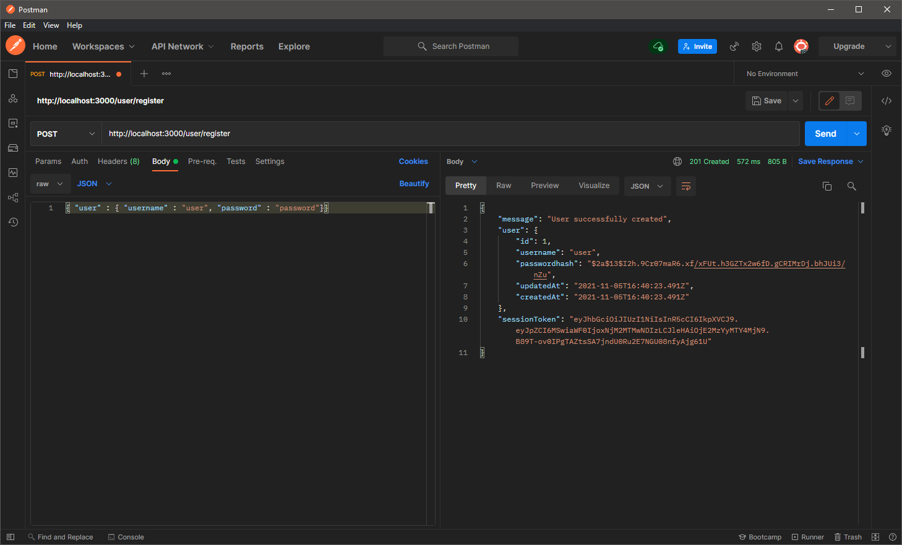
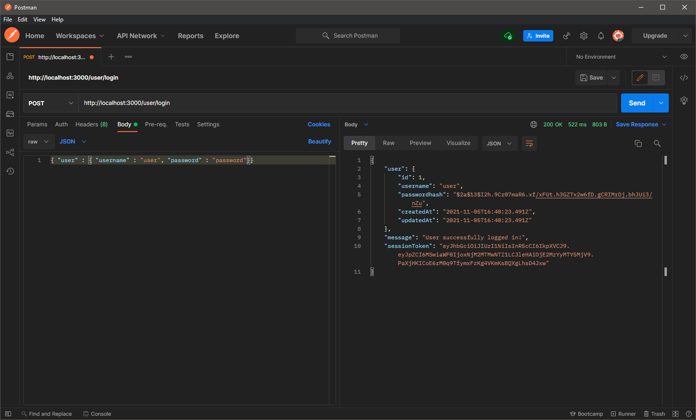
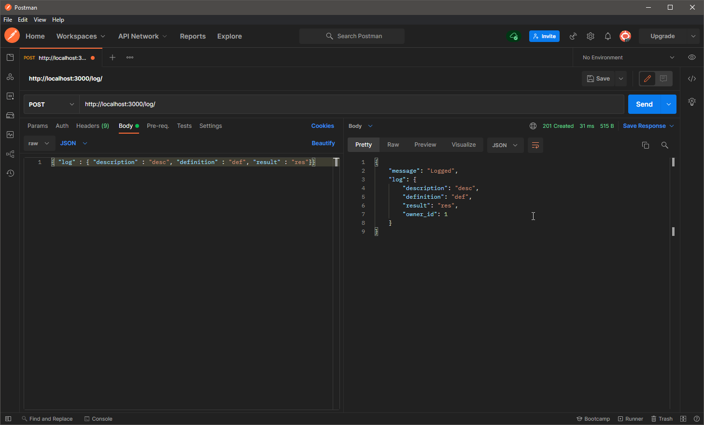
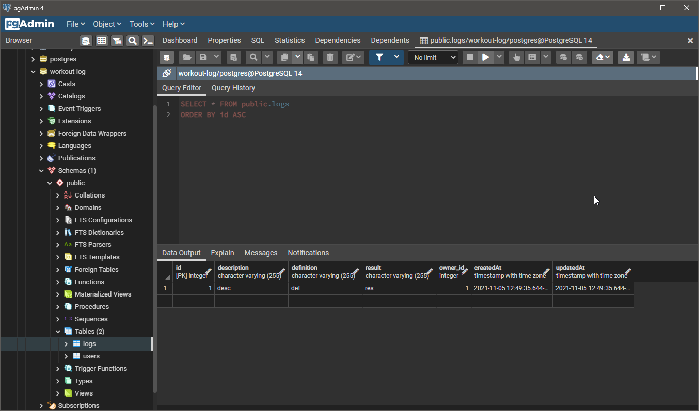
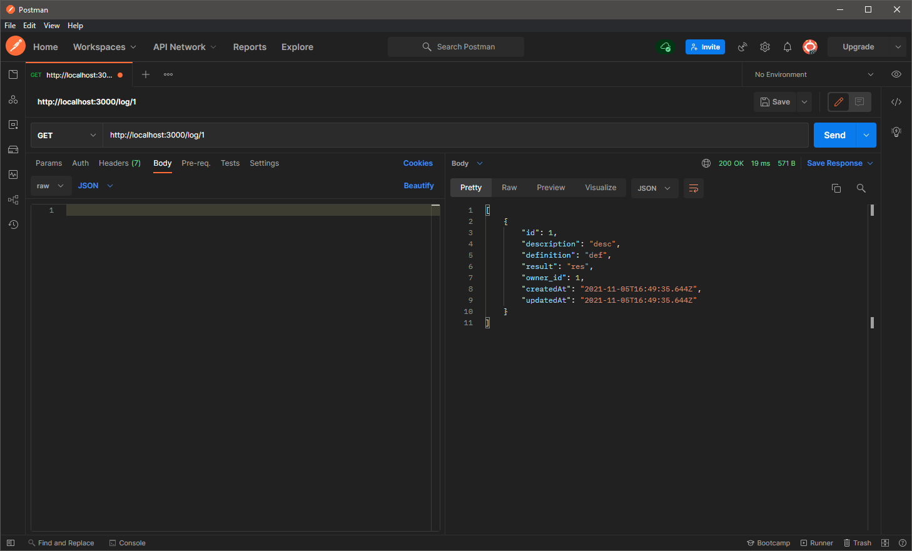
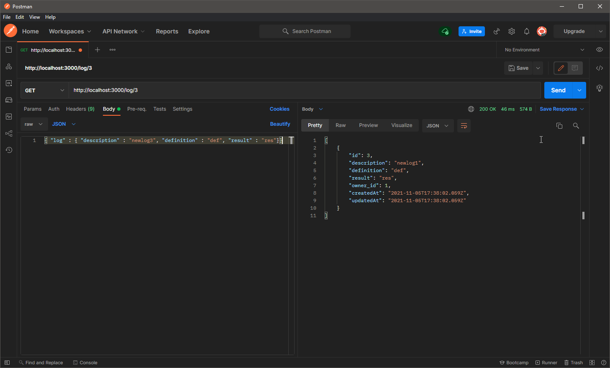
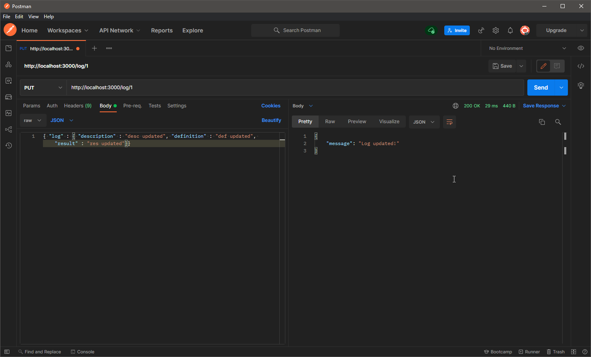
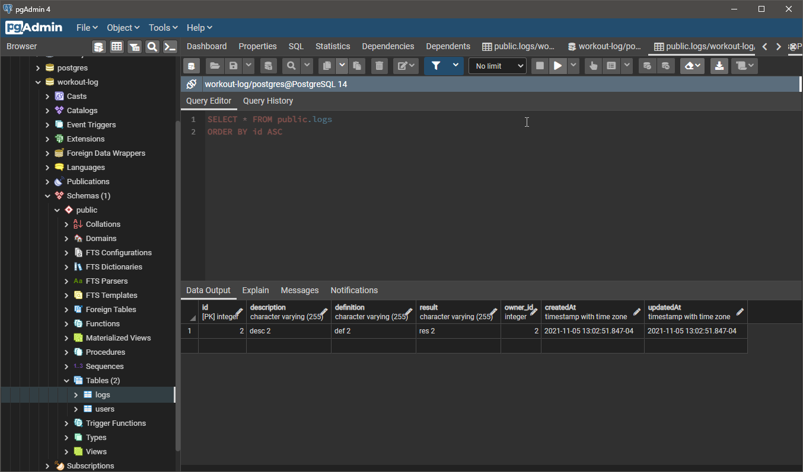

/user/register 	POST 	    Allows a new user to be created with a username and password.

/user/login 	POST 	    Allows log in with an existing user.

/log/           POST 	    Allows users to create a workout log with descriptions, definitions, results, and owner properties.

/log/           GET 	    Gets all logs for an individual user.

/log/:id        GET         Gets individual logs by {{id}} for an individual user.

/log/:id        PUT 	    Allows individual logs to be updated by a user.

/log/:id 	    DELETE 	    Allows individual logs to be deleted by a user.

